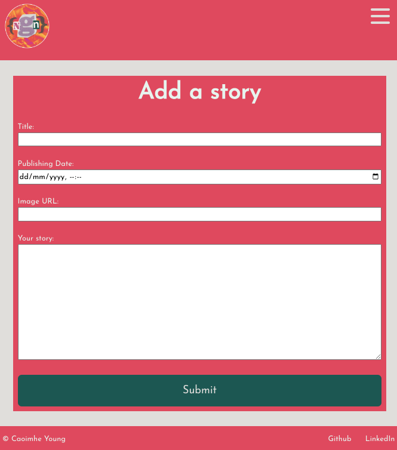

# News Glorious News

--- 
    

---

[About](#about) ✦ [Project Requirements](#project-requirements) ✦ [Features](#features) ✦ [Resources](#resources) ✦ [License](#license) ✦ [Contact](#contact)

---

## About
This project is a news app created using Django. Once running, the site allows you to view stories written by authors, create your own account and write your own stories. 

A full list of [features](#features) can be found below. 

To see a full video of the website walk through, click [here](https://youtu.be/0_TCeW0NVMw)

This project was created as part of She Codes Australia Plus Program, December 2023.

Starter code can be found [here](https://github.com/SheCodesAus/plus-django-news-project-template)

## How To Run This Code
*Please note this instructions are for MAC users.*
1. Clone repo
2. Create virtual environment (venv)

    `python -m venv venv`
3. Initialise repo

    `git init`
4. Activate venv

    `source venv/bin/activate`
5. Download the requirements

    `python -m pip install -r requirements.txt`
6. Migrate the database 

    `python manage.py loaddata news`

7. Run server

    `python manage.py runserver`

8. Enjoy browsing the stories.

## Database Schema!

## Features

*Order stories by date*

*Styled "new story" form with the ability to upload image URLs to the story. Users can select their publish date and time*

*Log-in. Logout available in the nav on all pages.*

*User profile page*

*"Create Account" page*

*View stories by author*

*"Log-in" button only visible when no user is logged in*

*"Write New Story" functionality only available when user is logged in*

*"Log-out" buttononly visible when a user is logged in*

*Ability to update and delete stories when the author is logged in*

*Ability to update and delete user information*

## Future Developments
1. Add categories to the stories and allow the user to search for stories bycategory.
2. Add the ability to “favourite” stories and see a page with your favouritestories.

## Resources
https://www.learningaboutelectronics.com/Articles/How-to-add-search-functionality-to-a-website-in-Django.php#google_vignette

https://medium.com/@tech-learner/upload-images-in-database-using-django-dc652941122b

## License

This project is using the following license:

**MIT**

For further information regarding the license, please follow the link below:
https://opensource.org/licenses/MIT

---

## Contact

If you have any further questions, please contact via email or github.

 
